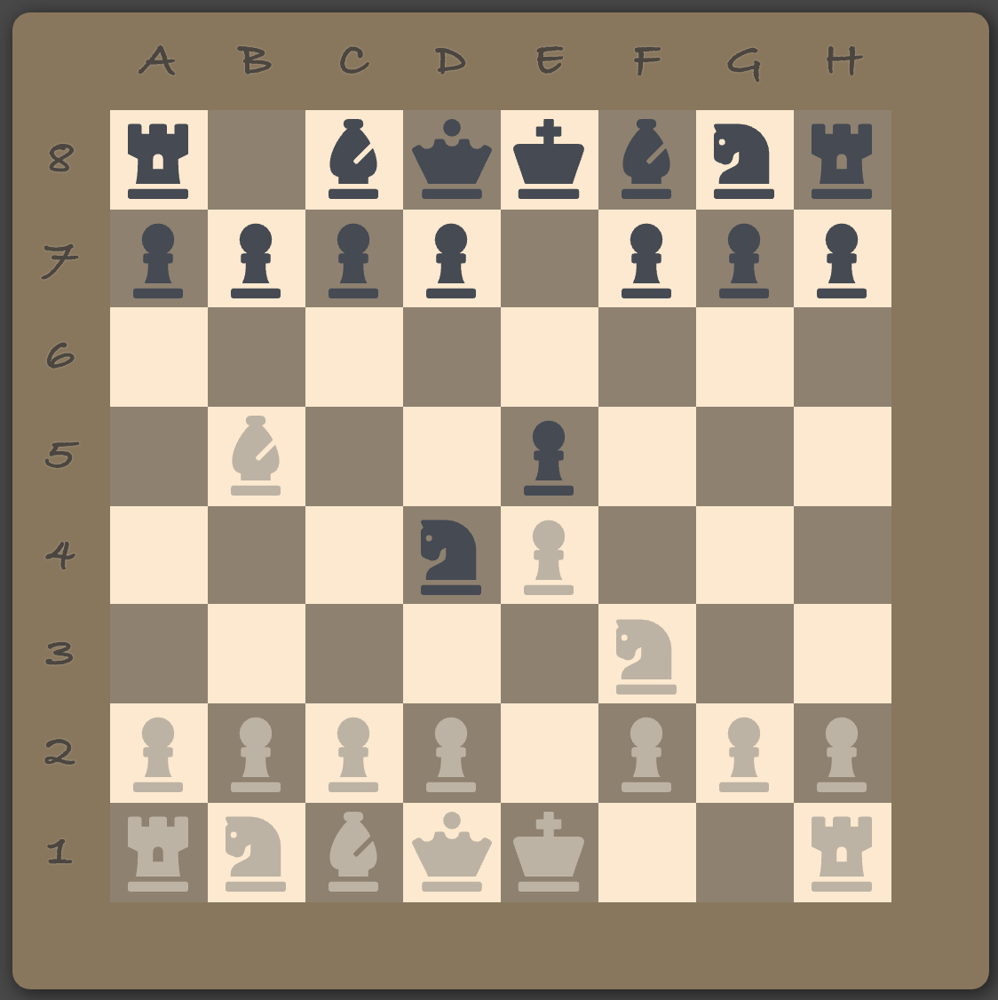

# React chess board

## Representaion of the board

**Forsyth–Edwards Notation (FEN):**
*r1bqkbnr/pppp1ppp/8/1B2p3/3nP3/5N2/PPPP1PPP/RNBQK2R*

|   | A | B | C | D | E | F | G | H |
| - | - | - | - | - | - | - | - | - |
| 8 | r | - | b | q | k | b | n | r |
| 7 | p | p | p | p | - | p | p | p |
| 6 | - | - | - | - | - | - | - | - |
| 5 | - | B | - | - | p | - | - | - |
| 4 | - | - | - | n | P | - | - | - |
| 3 | - | - | - | - | - | N | - | - |
| 2 | P | P | P | P | - | P | P | P |
| 1 | R | N | B | Q | K | - | - | R |

