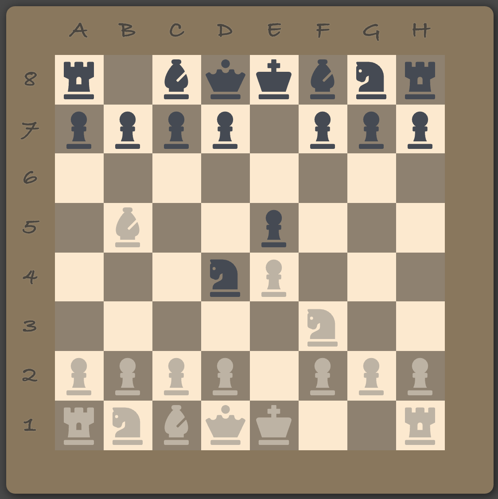

# Chess board + coach

A React chess board with **coach mode**: play against a strength-limited [Stockfish](https://stockfishchess.org/) opponent, get move feedback, and optional natural-language coaching via [Ollama](https://ollama.com/).

Built with **Vite**, **React 19**, and a small in-browser chess rules engine.



## Features

- Drag-free click-to-move board with legal-move highlighting
- **Coach mode**: Stockfish replies at ~your Elo + 80; games update your Elo (standard K-factor)
- Move classification (excellent → blunder) and move history with undo
- Check / checkmate indicators (banner + shaking king)
- Optional Ollama commentary and hints (app still works without it)
- Themes and piece styles (persisted in `localStorage`)

## Prerequisites

| Tool | Notes |
| --- | --- |
| **Node.js** | 18+ recommended (20+ ideal) |
| **npm** | Comes with Node |
| **Ollama** (optional) | Needed only for spoken coach tips / hints phrasing |

Stockfish WASM is installed via npm and copied into `public/stockfish/` on `npm install`.

## Setup

```bash
git clone https://github.com/acupy/chess-board.git
cd chess-board
npm install
```

`postinstall` copies the Stockfish lite build into `public/stockfish/`. If that folder is missing after install, run:

```bash
node scripts/copy-stockfish.js
```

## Run locally (Vite)

```bash
npm start
# or: npm run dev
```

Then open [http://localhost:3000](http://localhost:3000).

| Script | Purpose |
| --- | --- |
| `npm start` / `npm run dev` | Vite dev server (port **3000**) |
| `npm test` | Unit tests (Vitest) |
| `npm run build` | Production build → `dist/` |
| `npm run preview` | Preview the production build |

## Ollama setup (optional coach voice)

Coach **play and Elo work without Ollama**. If Ollama is down, the UI falls back to short template messages.

1. Install Ollama: [https://ollama.com/download](https://ollama.com/download)
2. Start the server (often already running as an app/service):

   ```bash
   ollama serve
   ```

3. Pull the default model used by this app (`qwen2.5:7b`):

   ```bash
   ollama pull qwen2.5:7b
   ```

4. Keep Vite running. Requests to `/api/ollama` are proxied to `http://127.0.0.1:11434` (see `vite.config.js`).

You should see live coach lines in the side panel when Ollama is up. If the model is missing or the server is stopped, a yellow note appears and play continues with fallback text.

### Using another model

Change `DEFAULT_MODEL` in `src/coach/ollama.js`, then `ollama pull <that-model>`.

## Coach mode tips

1. Open **Config** (gear) and enable **Coach mode**.
2. Set your starting Elo if you like (opponent strength tracks it).
3. Play as White; after each move the engine evaluates, comments, and replies.
4. Use **Hint**, **Undo**, **Resign**, and **New game** in the coach panel.

## Project layout

```
src/
  chess/          Rules, FEN, UCI helpers
  engine/         Stockfish worker client + move classification
  coach/          Elo, localStorage profile, Ollama client
  App.jsx         App shell + coach game loop
  Board.jsx       Board UI
  CoachPanel.jsx  Side panel
public/
  stockfish/      WASM engine (generated on install)
  img/            Piece sets + coach avatars
```

## Forsyth–Edwards Notation (FEN)

Positions are stored as FEN, e.g.:

`r1bqkbnr/pppp1ppp/8/1B2p3/3nP3/5N2/PPPP1PPP/RNBQK2R`

|   | A | B | C | D | E | F | G | H |
| - | - | - | - | - | - | - | - | - |
| 8 | r | - | b | q | k | b | n | r |
| 7 | p | p | p | p | - | p | p | p |
| 6 | - | - | - | - | - | - | - | - |
| 5 | - | B | - | - | p | - | - | - |
| 4 | - | - | - | n | P | - | - | - |
| 3 | - | - | - | - | - | N | - | - |
| 2 | P | P | P | P | - | P | P | P |
| 1 | R | N | B | Q | K | - | - | R |

## License

See repository for license details.
